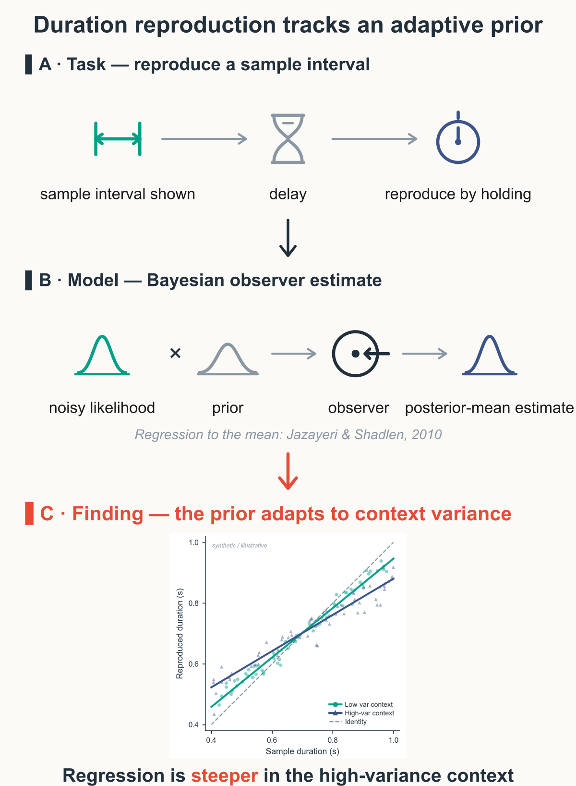
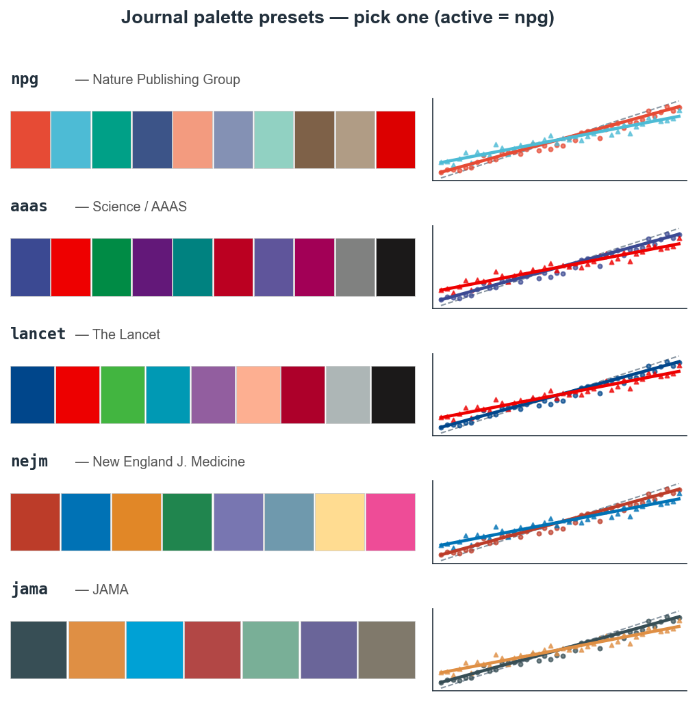
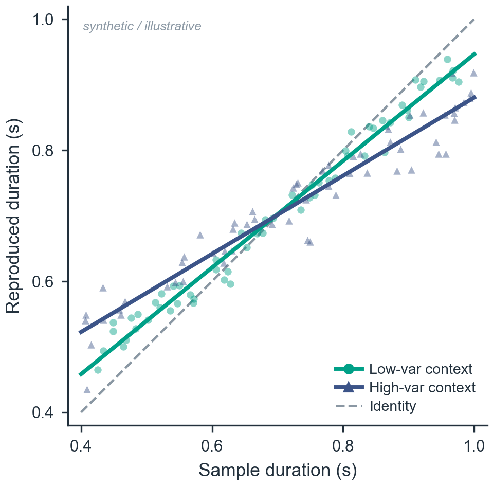
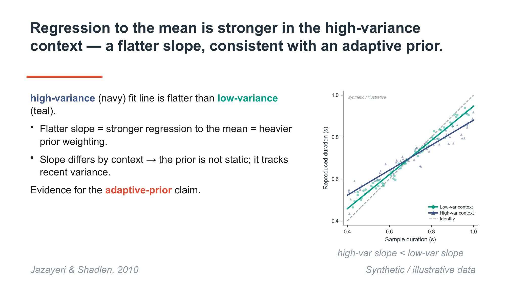
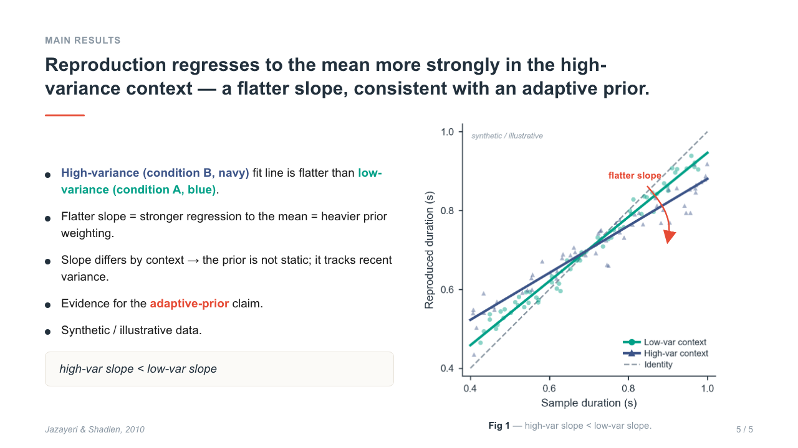

# Academic_Drawing

A **Claude Code harness** that produces, in order, a publication‑grade **graphical abstract**
(code‑authored vector SVG) and an **academic presentation deck** (editable PPTX *and* an HTML
"web" deck) for computational / cognitive‑neuroscience work — holding one journal palette, one
restrained voice, and one citation style across every deliverable, behind a
generate → mechanical‑QC → 3‑lens review → human‑confirm loop.

> Built for [Claude Code](https://claude.com/claude-code). It is a set of **agents** (`.claude/agents/`)
> and **skills** (`.claude/skills/`) orchestrated by one skill; it is not a standalone CLI.

## What it makes

| Deliverable | Format | Engine |
|---|---|---|
| **Graphical abstract** | vector **SVG** → PDF + 300‑dpi PNG, Cell‑square (1650²) or other venue | hand‑authored SVG from a comp‑neuro icon kit + `render.py` |
| **Slides** | editable **PPTX** *and/or* **HTML** web deck | `pptxgenjs` + a Claude‑design HTML path |
| **Plots** | code‑drawn matplotlib/seaborn, journal‑styled | `academic_mpl` (Arial + journal palette) |

Result figures, code‑based plots, and PDF‑crop regions are left as **clearly‑marked placeholders** —
the harness lays out and reserves their space but never fabricates their content.

## How to use it

> **Quick start (any field — not just neuro).** Open the folder in Claude Code and say what you want
> in one line — e.g. *"make a graphical abstract for my materials paper: a nanoparticle coating
> improves battery cycle life"*, or *"build the talk slides from this markdown"*. The harness picks a
> layout **archetype**, applies the default journal palette, **reserves placeholders** for figures
> you'll add later, and shows a **draft** — no up-front questionnaire. The only things it needs are a
> topic and one claim; conditions, venue, citations all default or become placeholders. It is
> **domain-agnostic** — the archetypes (pipeline, comparison, mechanism, hub, cycle, quadrant,
> hierarchy, …) and journal palettes fit any field; comp-neuro is just one optional icon set.

1. **Open this folder in Claude Code.** `CLAUDE.md` registers the harness so the orchestrator
   triggers automatically. First time on a machine, run `python3 bin/preflight.py` to check the
   environment (and `python3 bin/spec_lint.py` to lint the harness specs).
2. **Ask for a deliverable**, e.g. *"make a graphical abstract for my study"* or *"build the talk
   slides"* (English or Korean). That fires the `academic-drawing-orchestrator` skill.
3. **Provide a short brief**: background / gap / claim, the conditions, any data or result‑figure
   placeholders, target venue, and (optional) the Zotero entries for citations.
4. The harness runs:
   - **Lock the style contract** — fills the project's `label_map`, renders a palette swatch +
     contrast/CVD check; **you sign off**.
   - **Graphical abstract** — concept layout → SVG compose → live preview → overlap/font/equation QC
     → 3‑lens review (Codex rules · Opus logic · vision design) → **your confirm** → export.
   - **Slides** — outline (fixed section template, action titles) → build PPTX and/or HTML →
     style‑lint + render QC → 3‑lens review → **your confirm**. The approved abstract is reused on
     the Experimental‑Procedure slide.
5. **Follow‑ups** ("recolor condition B", "redo the results slide", "switch to portrait") run as
   partial re‑runs — only the affected agent and review re‑execute.

## Design rules (enforced, not hoped for)

- **Color** — one source of truth: [`palette.json`](.claude/skills/ga-style-contract/assets/palette.json).
  Reference colors by **token** (`cond_a`, `accent`, …), never raw hex. The default is the
  **NPG (Nature) journal palette**; switch to `aaas` / `lancet` / `nejm` / `jama` via `active_preset`.
  ≤5 structural colors per slide; one fixed condition→color map across abstract, plot, and deck;
  CVD safety via **mandatory redundant coding** (marker shape + line type + label), so color is never
  the sole distinction.

  

- **Text** — restrained academic tone, no AI‑slop, **no invented abbreviations/acronyms** (unknown
  terms are validated against the lab vocabulary or asked, never coined). Citations `Author et al.,
  YYYY`, **resolved from Zotero** (`format_citation.py`) — never hand‑authored.
- **Equations** — four‑stage gate: matplotlib‑mathtext render → **sympy** symbolic / undefined‑symbol
  check (`equation_qc.py`) → Codex symbolic review → vision legibility.
- **Layout** — text must not overlap shapes: deterministic bounding‑box collision detection
  (`overlap_check.py`, headless‑Chrome geometry) is a hard gate; decks get `pptx_style_lint.py`.
- **Typography** — Arial/Helvetica project‑wide, sentence case, journal font minima.

## What's inside

**Agents** (`.claude/agents/`, all run on Opus):
`drawing-director` (lead, style contract, human gate) · `concept-architect` · `svg-compositor` ·
`plot-engineer` · `slide-planner` · `slide-builder` (PPTX) · `slide-web-builder` (HTML) ·
`qc-renderer` (mechanical gates) · `naive-reviewer` (Codex, rules) · `logic-reviewer` (Opus, claim
chain) · `design-reviewer` (vision, SciGA rubric).

**Skills** (`.claude/skills/`):
`academic-drawing-orchestrator` (the pipeline) · `ga-style-contract` (palette/tone/citation/equation
contract + scripts) · `overlap-qc` (render + collision/lint/equation gates) · `slide-rhetoric`
(section template + action‑title/Minto rules) · vendored `graphical-abstract` (Cell‑grade SVG kit +
`render.py`) and `scientific-figure` (exact‑mm composition + font validation).

**Deterministic QC scripts** (`ga-style-contract/scripts/` and `overlap-qc/scripts/`):
`swatch.py` · `contrast_check.py` (WCAG+CVD) · `format_citation.py` (Zotero→cite) ·
`academic_mpl.py` (shared plot style) · `render_presets.py` · `overlap_check.py` ·
`pptx_style_lint.py` · `equation_qc.py`.

## Requirements

Confirmed present on the dev machine; install what's missing:

- **Render/QC stack**: `rsvg-convert`, `inkscape`, `cairosvg`, headless **Google Chrome**,
  LibreOffice `soffice` (absolute path), `pdftoppm`.
- **Python**: `matplotlib`, `seaborn`, `numpy`, `sympy`, `python-pptx`.
- **Node**: `pptxgenjs` (`npm i -g pptxgenjs`) for the PPTX path.
- **Optional**: a Zotero MCP (real citations), `markitdown[pptx]` (slide text QA), Codex CLI
  (independent naive reviewer).

## Example output

| | |
|---|---|
| Graphical abstract |  |
| Code‑drawn plot (NPG palette, Arial) |  |
| Slide — PPTX path |  |
| Slide — HTML web path |  |

*(Examples use a synthetic, clearly‑labelled illustrative dataset — not real results.)*

## Notes

- The vendored `graphical-abstract` and `scientific-figure` skills originate from the author's
  comp‑neuro project and are MIT‑licensed.
- The harness keeps reviewers **advisory** and ends every deliverable on a **human‑confirm gate** —
  it surfaces conflicts (including domain nuances a reviewer can get wrong) rather than deciding them.

## License

MIT — see [`LICENSE`](LICENSE).
